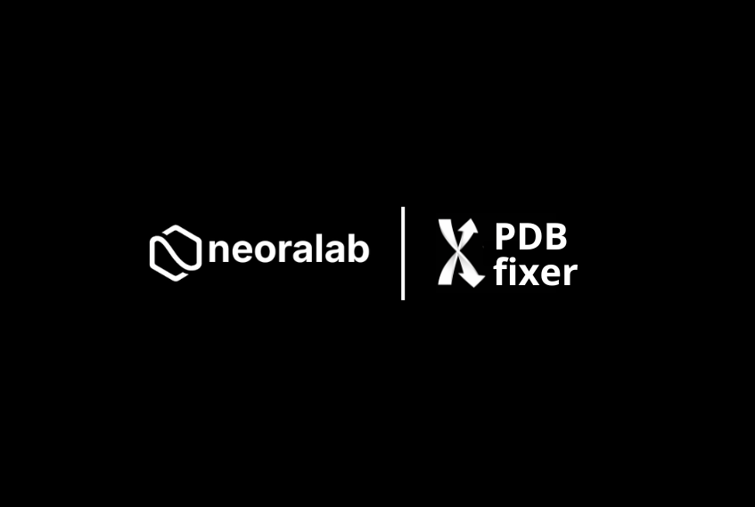

<p align="center">
  
</p>

<p align="center">
  <a href="https://github.com/openmm/pdbfixer/actions/workflows/CI.yml"></a>
  <a href="https://pypi.org/project/pdbfixer-neoralab/"></a>
  <a href="https://anaconda.org/conda-forge/pdbfixer"></a>
  <a href="https://pypistats.org/packages/pdbfixer-neoralab"></a>
  <a href="https://pypi.org/project/pdbfixer-neoralab/"></a>
  <a href="LICENSE"></a>
  <a href="https://htmlpreview.github.io/?https://github.com/openmm/pdbfixer/blob/master/Manual.html"></a>
  <a href="https://github.com/neoralab/pdbfixer/graphs/contributors"></a>
  <a href="https://github.com/openmm/pdbfixer/graphs/contributors"></a>
</p>

# PDBFixer

PDBFixer is a Python library for repairing and preparing Protein Data Bank (PDB) files before simulation. It focuses on an intuitive API that automates common cleanup steps so structures are ready for downstream workflows without manual editing.

## Overview

PDBFixer can automatically:

- Add missing heavy atoms and hydrogens.
- Build missing loops.
- Convert non-standard residues to standard equivalents.
- Select a single position for atoms with alternate locations.
- Remove unwanted chains or heterogens.
- Build a water box for explicit solvent simulations.

Consult the [manual](https://htmlpreview.github.io/?https://github.com/openmm/pdbfixer/blob/master/Manual.html) for full usage guidance.

## Improvements over the OpenMM fork

- Published on PyPI as [`pdbfixer-neoralab`](https://pypi.org/project/pdbfixer-neoralab/) with support for Python 3.11 and newer.
- Modernized packaging via `pyproject.toml` and `versioningit`, keeping releases in sync with Git tags.
- Distributed purely as a Python API, removing the legacy web and command-line interfaces to focus on library usability.

## Installation

### PyPI or uv
Install with pip or uv (Python 3.11+):

```bash
pip install pdbfixer-neoralab
```

```bash
uv pip install pdbfixer-neoralab
```

### Conda
Install from conda-forge:

```bash
conda install -c conda-forge pdbfixer
```

### From source
Clone the repository and follow the manual for source installation details.

## Versioning

PDBFixer uses [versioningit](https://versioningit.readthedocs.io/) to derive its version from Git tags. Building from a source checkout therefore requires either a cloned repository with Git metadata or a source distribution that already includes the generated version. When no tag information is available, the default reported version is `0+unknown`. To preview the build version:

```bash
python -m versioningit
```

## Quickstart

PDBFixer is distributed purely as a Python API. Use it directly from your code:

```python
from pdbfixer import PDBFixer

fixer = PDBFixer(filename="input.pdb")
fixer.findMissingResidues()
fixer.findMissingAtoms()
fixer.addMissingAtoms()
fixer.addMissingHydrogens(pH=7.0)
```

